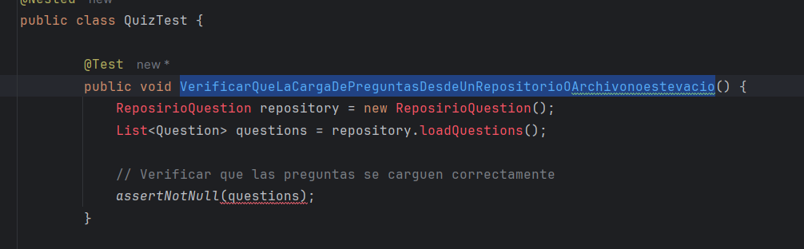

# Spring1

Sprint 1: Estructura básica y preguntas (2 puntos)
**Objetivo:** Configurar el entorno del proyecto y desarrollar la lógica básica para la manipulación y
presentación de preguntas y respuestas.
**Tareas:**

1. Configurar el entorno del proyecto utilizando Gradle, incluyendo la dependencia para JUnit 5.(realizado)
2. Desarrollar la clase Question con atributos para la descripción de la pregunta, las opciones
   disponibles y la respuesta correcta.
3. Implementar la clase Quiz que manejará el flujo del juego, incluyendo cargar preguntas,
   presentarlas al usuario y recibir respuestas.
4. Programar la lógica para mostrar preguntas de manera secuencial y permitir al usuario
   ingresar respuestas.
5. Escribir pruebas unitarias para asegurar que las preguntas se carguen correctamente y que
   las respuestas sean validadas adecuadamente.

**Casos de prueba para JUnit:**
• Verificar que la carga de preguntas desde un repositorio o archivo esté correcta.
• Asegurar que el sistema acepte y valide respuestas de manera adecuada, incluyendo la
captura de entradas inválidas como letras o números fuera del rango.

Para desarrolllar las tareas empezaremos usando el enfoque TDD :

**1CICLO : VerificarQueLaCargaDePreguntasDesdeUnRepositorioOArchivonoestevacio**

ROJO:

escribimos la prueba

la ejecutamos y vemos que no pasa :

VERDE :

Con la ayuda del IDE corrigamos los errores :

Creando el constructor de la clase Question :

Ejecutamos la prueba ,pasoo! :

AZUL : Refactoricemos :

**2CICLO : Verificar que la carga de preguntas desde un repositorio o archivo esté correcta.**

RED:

VERDE :

modificamos la clase repositorio :

Para una pregutna :

Ejecutamos nuevamente el test:

