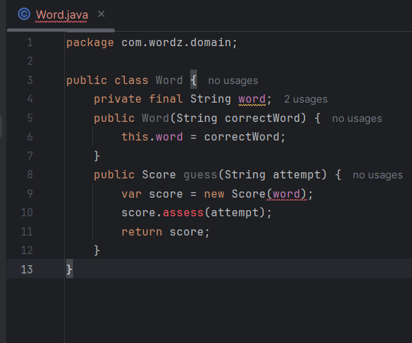

# Spring1 Word

En este sprint, se configura el entorno y se implementa la lógica básica del juego.

Haremos uso del enfoque **TDD** para las pruebas unitarias ademas usaremos **Soanrqube** para la refactorizacion del codigo .

**Clase Word**
La clase Word será responsable de almacenar la palabra correcta y evaluar las suposiciones.
Usaremos el código proporcionado para definir cómo se verifica cada suposición:

**Clase Score**

Ahora usaremos el enfoque TDD para las pruebas iniciales

**1°Ciclo TDD: `oneIncorrectLetter` & `oneCorrectLetter`**

ROJO :

La prueba `**oneIncorrectLetter`** verifica que  la letra de la palabra correcta no coincide con la letra ingresada , en caso de ser incorrecta imprime INCORRECT mientras que `oneCorrectLetter` verifica que la letra ingresada sea la misma letra correcta y en caso de ello imprime CORRECT.

La prueba falla !

VERDE :

Corrijamos los errores, para que la prueba pase .

La prueba paso :

AZUL REFACTORIZACION :

Vemos que podemos refactorizar el metodo asses , para ello crearemos el metodo  `scoreFor`

Haciendo uso de Sonarquebe vemos los olores de codigo:

1er olor de codigo :

Ejecutamos nuevamente las pruebas para ver que no se hayan generado errores  :

2do olor de codigo :

Ejecutamos las pruebas nuevamente :

