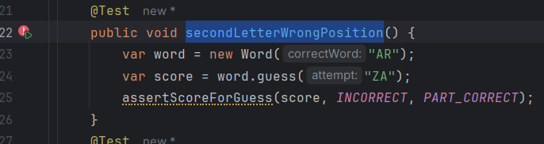

# Spring2Word

**Ampliación de la lógica de juego**

Objetivos:
• Ampliar la lógica del juego para incluir retroalimentación detallada sobre las suposiciones.
• Continuar el desarrollo utilizando TDD.

**1ER CICLO TDD :  `secondLetterWrongPosition` & `allScoreCombinations`**

ROJO :

Ejecutamos  la prueba :

VERDE :

**.** Agreguemos al código inicial para verificar todas las letras en nuestra adivinación:

La prueba paso!! (**`Verde`**)

AZUL : REFACTORIZACION :

Podemos refactorizar la clase Score :

Ejecutemos las pruebas :

Ahora con el uso de Sonarquebe :

Vamos a corregir los 2 olores de codigo :

Removemos :

Ejecutamos nuevamente los test :

