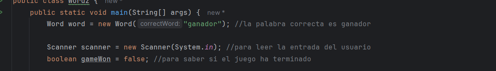

# Spring3Wordz

Vamos a crear la interfaz del juego para ello moidficaremos la clase `Wordz`

Instaciamos el objeto word de la clase `Word`

gameWon : boleano para verificar si el juego a terminado , por defecto esta en `false`

Logica del juego :

En el bucle while se guardara la palabra ingresada y se mostrara el score de cada letra de la palabra

si todas las letras tienen como score **CORRECT ,**entonces has ganado el juego en otro caso perdiste.

